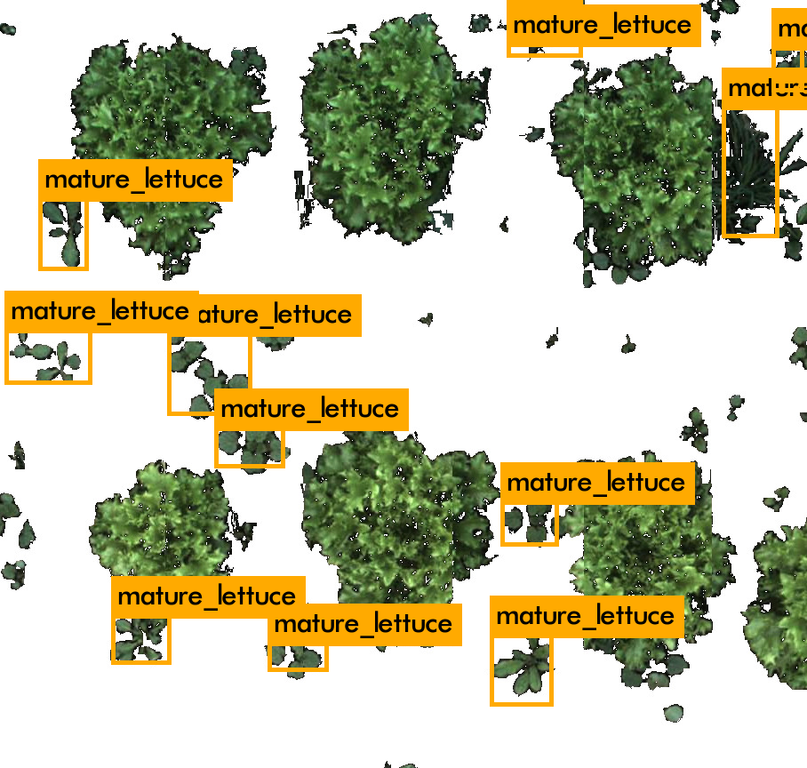
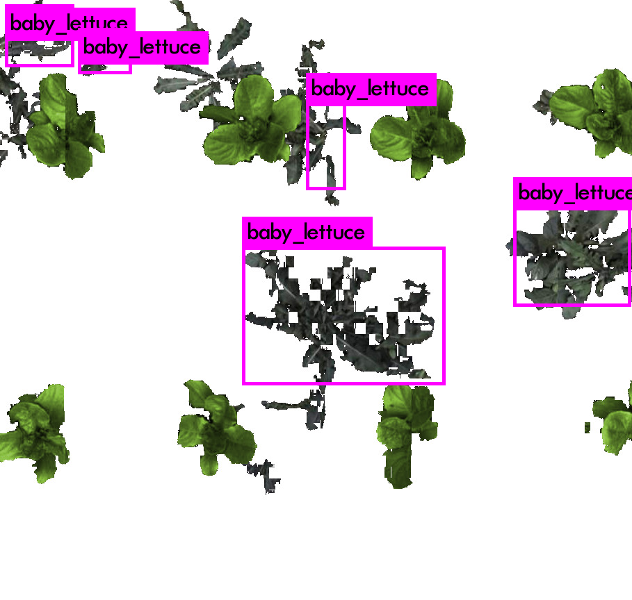
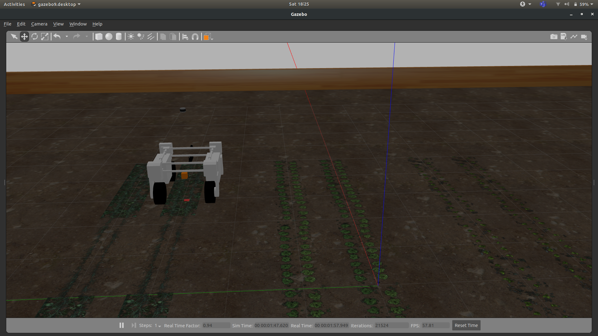
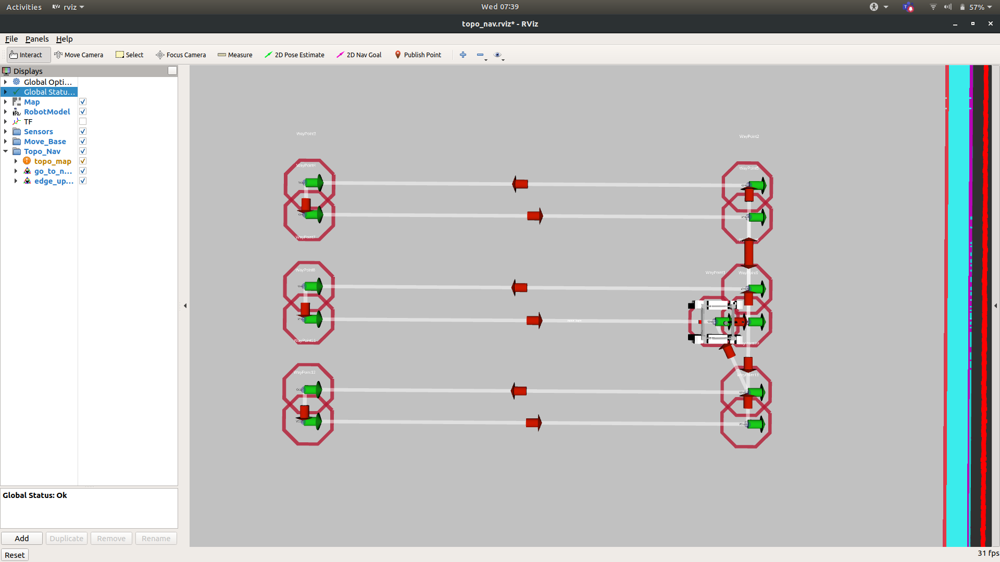

# Weeding Robot
> A weeding robot built with rospy and simulated on Gazebo with YOLO-based object tracking features.

## Table of Contents
* [Technologies Used](#technologies-used)
* [Features](#features)
* [Screenshots](#screenshots)
* [Usage](#usage)
* [Project Status](#project-status)
* [Room for Improvement](#room-for-improvement)
* [Acknowledgements](#acknowledgements)
<!-- * [License](#license) -->

## Technologies Used
- Darknet
= ROS
- Gazebo
- Rviz

## Features
- Thorvald robot navigates autonomously around the field using a predefined map using Odometry-configured waypoints
- Object detection of lettuce and onions via YOLOV2-TINY
- Transformation of camera coordinates to world coordinates
- Removal of weed

## Screenshots

